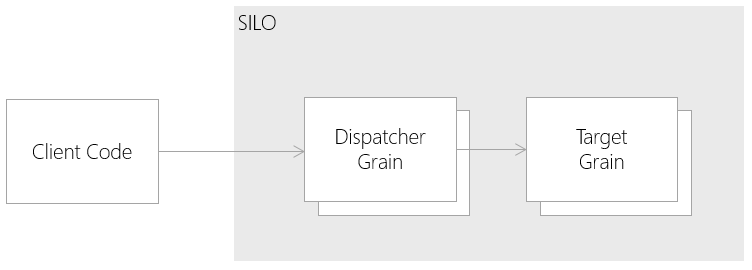

# Orleans Dispatcher Pattern

## Intent

A technique to send a batch of messages into Orleans in a single call, and have them distributed internally to the correct grains.

## Also Known As

## Motivation

When sending messages into an Orleans system, it can sometimes be more efficient to send a batch of messages in a single call, rather than a message at a time. A dispatcher grain can distribute these messages to the required grains internally.

## Applicability

Use the Dispatcher pattern in the following situations:

* When messages are received in batches (i.e. when popping messages off an Azure CloudQueue, 32 can be received at a time)
* When a batch of messages requires decoding before the target grains are known.
* When latency between client code and the Orleans Silo is high.

## Structure



## Participants

* __Client Code__ 
  * Generates batches of messages to send to Orleans.
* __Dispatcher Grain__ 
  * A stateless worker, responsible for processing a batch of messages, and fanning these out to the target grains.
* __Target Grain__
  * The grain we want to ultimately send the message to

## Collaborations

* The 'Client Code' sends a batch of messages to the 'Dispatcher Grain'.
* The 'Dispatcher Grain' enumerates through the batch, and send a message to each target grain.

## Consequences

* For Orleans systems with a small number of silos, the efficiency is improved, as there is a greater chance of the target grain being on the same node as the dispatcher grain, which leads to less inter-silo communication.
* The pattern is more useful when the message batch requires some decoding, and the target grain is not known by the client code. The dispatcher grain will auto-scale when required, in response to the load on the system.

## Implementation

## Sample Code

Target Grain interface:

```cs
public interface ITargetGrain : IGrain
{
    Task Send(string message);
}
```

Dispatcher Grain interface:

```cs
public interface IDispatcherGrain : IGrain
{
    Task Send(Tuple<int, string>[] messages);
}
```

Dispatcher Grain class:

```cs
public class DispatcherGrain : IDispatcherGrain
{
    public Task Send(Tuple<int, string>[] messages)
    {
        var tasks = new List<Task>();
        foreach (var message in messages)
        {
            var grain = TargetGrainFactory.GetGrain(message.Item1);
            tasks.Add(grain.Send(message.Item2));
        }
        return Task.WhenAll(tasks);
    }
}
```

## Known Issues

* Although this pattern can reduce the amount of network activity for sending a batch of messages, it does introduce an extra step between the client code, and the target grain, which can increase the latency of the solution.

## Related Patterns

