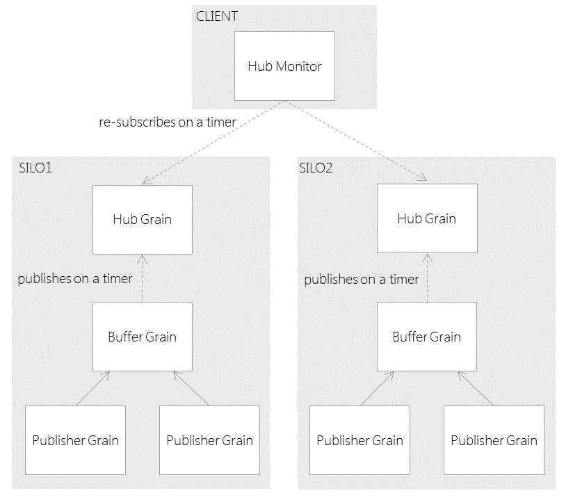

# Orleans Hub Pattern

## Intent

Provides clients with a single well-known observable endpoint by channeling events from multiple event sources.

## Also Known As

Event Aggregator [[Fowler]](http://martinfowler.com/eaaDev/EventAggregator.html)

## Motivation

A system with lots of observable grains can lead to complexities when a client wants to subscribe to all of them. The client has to find and register for each grain individually. 

Moreover, not all grains are active all the time, but due to client subscription requests a grain will be spawned and will keep occupying memory, despite of whether it has any useful work to do or not. This is because observable subscriptions are transient, which requires client to periodically re-subscribe and thus needlessly resurrect all grains.

A Hub acts as a single source of events for many of grains, allowing clients to register with just the hub. Since hub is essentially a Singleton it might introduce a severe performance penalty in the system. This is further optimized by application of [Reduce](Reduce.md) and [Cadence](Cadence.md) patterns, and also by making sure that all calls to a hub are local only.      

Since a separate instance of hub is created for each silo, there is no single address to which client could subscribe. This requires some sophistication from client but existing infrastructure management capabilities built into Orleans framework makes it nearly trivial.

## Applicability

Use the Hub pattern in the following situations:

* Hub is a good choice when you have lots of grains that are potential event sources. Rather than have the client deal with registering with them all, you can centralize the registration logic to the Hub. As well as simplifying registration, a Hub also simplifies the memory management issues in using observable grains.
* You need to periodically gather silo-specific information, such as performance/throughput metrics and Hub grain which is guaranteed to be local to a silo could be a good choice, allowing you to reuse existing communication infrastructure provided by Orleans framework.     

## Structure

## Participants

* __Publisher Grain__
  * The actual event source. Can publish a number of different events
* __Buffer Grain__
  * Provides an interface for grains to publish individual events into a hub
  * Buffers and propagates events to the hub
  * This grain is a `[StatelessWorker]` and will be auto-scaled by Orleans
* __Hub Grain__
  * Provides an interface for clients to subscribe for event notifications
  * This is a Singleton hosted in each silo
* __Hub Monitor__
  * Listens to hub notifications
  * Periodically resubscribe to all hubs by acquiring information on active silos via Orleans management infrastructure
  * Provides a unified easy-to-use interface for clients by hiding complexities of managing transient subscriptions   

## Collaborations

* The 'Publisher Grain' publishes individual events to the 'Buffer Grain', which simply puts them into internal queue.
* The 'Buffer Grain' periodically sends collected events to the 'Hub Grain' effectively batching them. 
* The 'Hub Grain' upon receival of batch of events from 'Buffer Grain' immediately publish them to all registered subscribers by utilizing built-in one-way communication capabilities of Orleans' framework.
* The 'Hub Monitor' subscribes to 'Hub Grain' by using management infrastructure provided by Orleans' framework. Upon receival of batch of events will simply dispatch them locally to all interested subscribers.    

## Consequences

* __Out-of-order processing__ As the 'Buffer Grain' is a stateless worker, there will be multiple instances activated in each silo, so each time the 'Publisher Grain's publish an event it might go to a different instance of 'Buffer Grain', thus breaking an original order of events. This could be fixed by applying [Resequencer](http://www.eaipatterns.com/Resequencer.html) EIP pattern either on client side or within 'Hub Grain' itself.
* __Increased latency__ between the moment when event was generated and the moment it was received by the client. 
 
## Implementation

Due to virtual nature of actors in Orleans, there some complexities and dangers for proper implementation of this pattern. Still, with few special hints and hooks available in Orleans framework it is possible to have a reliable implementation. 

## Sample Code

See included sample at [samples/Hub](samples/Hub)

## Known Issues

- Can be activated only from within a Bootstrap Provider.
- All client requests could only be made after first consulting Orleans' management infrastructure. 

## Related Patterns
[Reduce](Reduce.md)
[Cadence](Cadence.md)