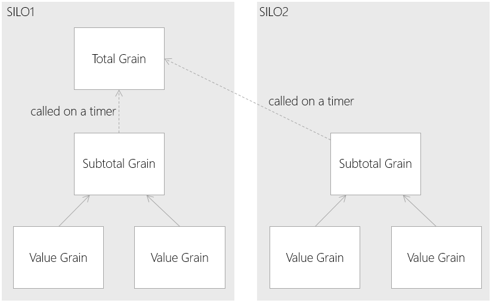

# Orleans Reduce Pattern

## Intent

Provides a hierarchical structure to aggregate a value stored in many grains, which would be unachievable with a fan-out.

## Also Known As

## Motivation

A side-effect to isolating state in grains, which are in turn distributed across a cluster of machines is that it is hard to retrieve an aggregate, for example a total, or average of a variable held by the grain.

A fan-out could be used to retrieve the value from a small number of grains, but approach starts to fail when the number of grains increase. It would also be necessary to know in advance which grains need to participate in the fan-out.

The Reduce approach is for a Singleton grain to record the total value, and for all grains contributing to this value should call this Singleton. The problem with doing this directly is that it introduces a severe performance penalty in the system. It's conceivable that every request to the system could ultimately result in the call to the Singleton, thus creating a bottleneck, as the Singleton would be unlikely to cope with the volume of requests. Many of these requests would also cross Silo boundaries, which are expensive.

The Reduce pattern solves this problem by introducing a StatelessWorker grain which is responsible for collecting results in each of the silos. This grain then periodically publishes the number to the Singleton, which may be in a different silo.

## Applicability

Use the Reduce pattern in the following situations:

* You want to aggregate a value, or perform a count over a large number of grains, distributed across silos. For example you want an average, min/max of a value held by all grains.

## Structure



## Participants

* __Value Grain__
  * Holds the value for which you want to apply an aggregate function to
* __Subtotal Grain__
  * Holds the sub total for local silo
  * Provides an interface for values grains to report changes in their value
  * This grain is marked as a `[StatelessWorker]`
* __Total Grain__
  * Holds the overall total
  * Provides an interface for 'Subtotal Grains' to report changes in their value

## Collaborations

* The 'Value Grain' reports changes in it's internal state to the 'Subtotal Grain', which maintain the current sub-total for the silo.
* The 'Subtotal Grain' periodically reports changes in it's internal state to the 'Total Grain'. 
* The 'Total Grain' can be queried at any time to retrieve the last known total value for the system

## Consequences

* __Quick to update the subtotal grain__ As the 'Subtotal Grain' is a stateless worker, it will be activated in each silo. Calls to it will not cross a process boundary, and will therefore be fast.
* __The subtotal grain auto scales__ If a queue of calls does build up on the 'Subtotal Grain', it will be automatically scaled. This should have no lasting side effect, as the aggregate function will simply be aggregated across more of these grains.
* __The system is eventually consistent__ The 'Subtotal Grain' must update the 'Total Grain' periodically, to avoid network congestion. Therefore the total value held by this grain will not reflect the exact real value. It has eventual consistency.
* __Only simple aggregations can be used__ Attempting to transmit more than simple state up the hierarchy will result in a large memory overhead in the 'Total Grain' and and a large amount of data transmitted over the network.

## Implementation

## Sample Code

Value Grain Interface

```cs
public interface IValueGrain : Orleans.IGrain
{
    Task SetValue(int value);
}
```

Value Grain Implementation

```cs
public class ValueGrain : Orleans.GrainBase, IValueGrain
{
    int localValue = 0;
    public async Task SetValue(int value)
    {
        if (localValue != value)
        {
            var grain = SubtotalGrainFactory.GetGrain(0);
            await grain.SetDelta(localValue - value);
        }
        localValue = value;
    }
}
```

Subtotal Grain Interface

```cs
[StatelessWorker]
public interface ISubtotalGrain : Orleans.IGrain
{
    Task SetDelta(int value);
}
```

Subtotal Grain Implementation

```cs
public class SubTotalGrain : Orleans.GrainBase, ISubtotalGrain
{
    int runningTotal = 0;

    public override Task ActivateAsync()
    {
        RegisterTimer(ReportRunningTotal, null, TimeSpan.FromSeconds(1), TimeSpan.FromSeconds(1));
        return base.ActivateAsync();
    }

    async Task ReportRunningTotal(object _)
    {
        var totalGrain = TotalGrainFactory.GetGrain(0);
        await totalGrain.SetDelta(runningTotal);
        runningTotal = 0;
    }

    public Task SetDelta(int value)
    {
        runningTotal += value;
        return TaskDone.Done;
    }
}
```

Total Grian Interface

```cs
public interface ITotalGrain : Orleans.IGrain
{
    Task SetDelta(int value);
    Task GetTotal();
}
```

Total Grain Implementation

```cs
public class TotalGrain : Orleans.GrainBase, ITotalGrain
{
    int total;

    public Task SetDelta(int value)
    {
        total += value;
        return TaskDone.Done;
    }

    public Task GetTotal()
    {
        return Task.FromResult(total);
    }
}
```

## Known Issues

## Related Patterns

