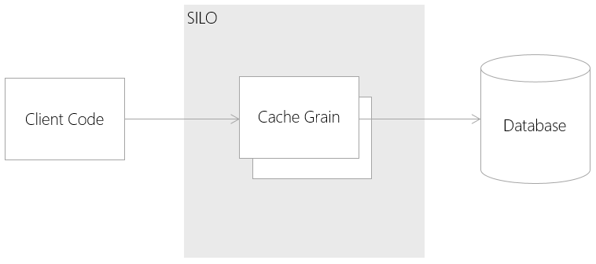

# Orleans Smart Cache Pattern

## Intent

A performance optimization which uses Orleans as a distributed caching system in front of a storage system. Allows reads to be served from memory, and provides the option for buffering writes.

## Also Known As

## Motivation

Storage is often the bottleneck in a large system. Caching data in fast-access memory both reduces the latency of the overall system, and reduces the load on storage.

Orleans can provide a cache with immediate consistency, with the efficiency of having one instance of each object in memory across the cluster.

## Applicability

Use the Smart Cache pattern in the following situations:

* You have a storage system (such as a database) which is introducing an unacceptable latency to your system.
* Or you have a storage system which cannot handle the number of requests per second required by your system.
* Or you have a system which is predominantly read, rather than write.
* Or you have a system which has a high transaction rate for writes, and you can accept a an increased risk in data loss.
* You have a system which uses data in a document-orientated approach, rather than by composing queries.

## Structure



## Participants

* __Database__
  * Database system which you wish to cache
* __Cache Grain__ 
  * Maintains the value of a record in the database. There is an instance of the cache grain for every record in the database.
* __Client Code__
  * Consumes the cache data.

## Collaborations

* The 'Client Code' calls the 'Cache Grain' to read and write values stored in the 'Database'.
* When the 'Cache Grain' activates, it loads the record from it's primary key from the 'Database' and stores it in memory.
* When 'Client Code' sends a read operation to the 'Cache Grain', the 'Cache Grain' returns the value from memory.
* When the 'Client Code' sends a write operation to the 'Cache Grain' it can either pass the write through immediately to the 'Database', or buffer the write, and perform the write to the database on a timer. This means the 'Database' and the cache can become out of step. The chance of data loss increases, but will reduce write transactions to the 'Database'.

## Consequences

* __Read hits to the system are fast__ as the grain holds the data in memory.
* __Writes to the system can be buffered__ at the cost of increased chance of data loss.
* __Using Orleans Persistence Providers could reduce development time__ as the data access code is already provided.

## Implementation

## Sample Code

Cache Grain Interface:

```cs
public interface ICacheGrain : IGrain
{
    Task Write(string value);
    Task<string> Read();
}
```
Cache Grain Implementation (without write buffering):

```cs
public interface IDatabaseState : IGrainState
{
    string Value { get; set; }
}

[StorageProvider(ProviderName="Database")]
public class CacheGrain : Orleans.GrainBase<IDatabaseState>, ICacheGrain
{
    public async Task Write(string value)
    {
        if (value == State.Value) return;
        State.Value = value;
        await State.WriteStateAsync();
    }

    public Task<string> Read()
    {
        return Task.FromResult(State.Value);
    }
}
```

Cache Grain Implementation (with a write buffer):

```cs
[StorageProvider(ProviderName="Database")]
public class CacheGrain : Orleans.GrainBase<IDatabaseState>, ICacheGrain
{
    bool stateChanged = false;

    public override Task ActivateAsync()
    {
        RegisterTimer(WriteState, null, TimeSpan.FromSeconds(5), TimeSpan.FromSeconds(5));
        return base.ActivateAsync();
    }

    async Task WriteState(object _)
    {
        if (!stateChanged) return;
        stateChanged = false; 
        await State.WriteStateAsync();
    }

    public Task Write(string value)
    {
        if (value == State.Value) return TaskDone.Done;
        State.Value = value;
        stateChanged = true;
        return TaskDone.Done;
    }

    public Task<string> Read()
    {
        return Task.FromResult(State.Value);
    }
}
```

Note the implementations use a Storage Provider to write to the database.


## Known Issues

* Queries (such as aggregates, filters and joins) cannot easily be cached, as it is hard to know when they have been invalidated. Therefore the cache is suitable for records by record access more so than a querying system.
* In case of cache misses, the cache introduces a latency, which will slow down the system.
* If writes are buffered, there is an increased risk of data loss, of the silo terminates unexpectedly before an outstanding write it committed.

## Related Patterns

